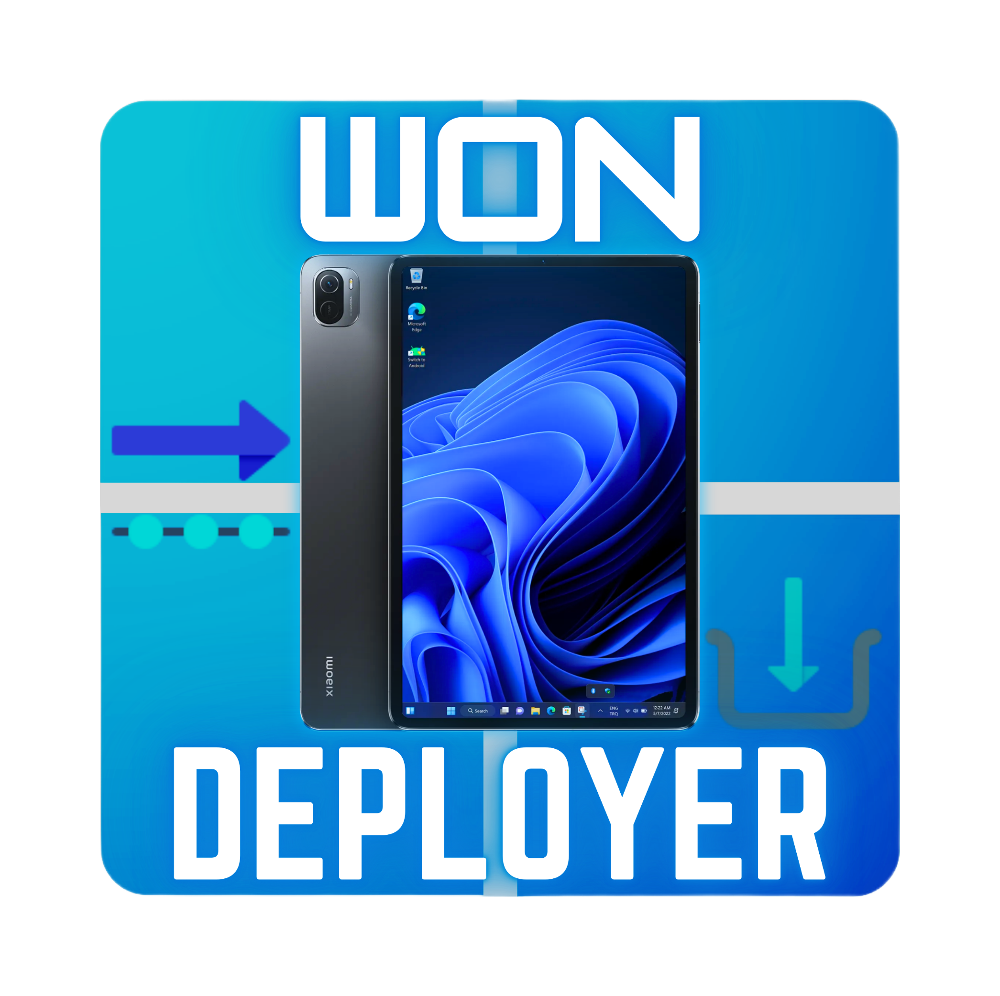

<a </a>

# Running Windows on the Xiaomi Pad 5
## Try out my new tool for automatically installing Windows on Nabu—it's currently in beta. I’d love your feedback on any issues or ideas for new features. Share your thoughts with me via the Telegram link below."

## ⚠️ Warning
> [!NOTE]
> - We're not responsible for bricked devices, missing recovery partitions, dead xiaomi factoryline workers cowboys, dead pmics, dead ram, dead display ics, dead cpus, any xiaomi shenanigans, dead cats or dogs, nuclear wars or you getting fired because you forgot to boot back into android for the alarm.
> - This project is in development stage, all the files here have been contributed by other users, here you will find a guide with the working files we managed to get. This is a delicate process, do it under your own risk and follow all the steps carefully.

> [!WARNING]
> **IF YOU AREN'T COMFORTABLE MODDING YOUR TABLET OR ITS PARTITION TABLE OR YOU ARE PARANOID OF BRICKING YOUR DEVICE CLICK AWAY NOW!!! YOU HAVE BEEN WARNED, YOU ARE ON YOUR OWN IF YOU BRICK YOUR DEVICE!!! AGAIN! YOU HAVE BEEN WARNED!!!**

## Get Started

- [Installation/run new](guide/English/won-deployer-install-en.md)
  
- [Official Guide](https://github.com/erdilS/Port-Windows-11-Xiaomi-Pad-5)

## Miscellaneous

- [Bootloader unlocking guide](guide/English/unlock-bootloader-en.md)

## Credits and Thankfull to

- [@timoxa0](https://git.timoxa0.su/timoxa0) - linux on nabu deployer ([here](https://git.timoxa0.su/timoxa0/Guide-Linux-Nabu))
- [@timoxa0](https://github.com/timoxa0) - linux on nabu deployer ([here](https://github.com/timoxa0/Guide-Linux-Nabu))

