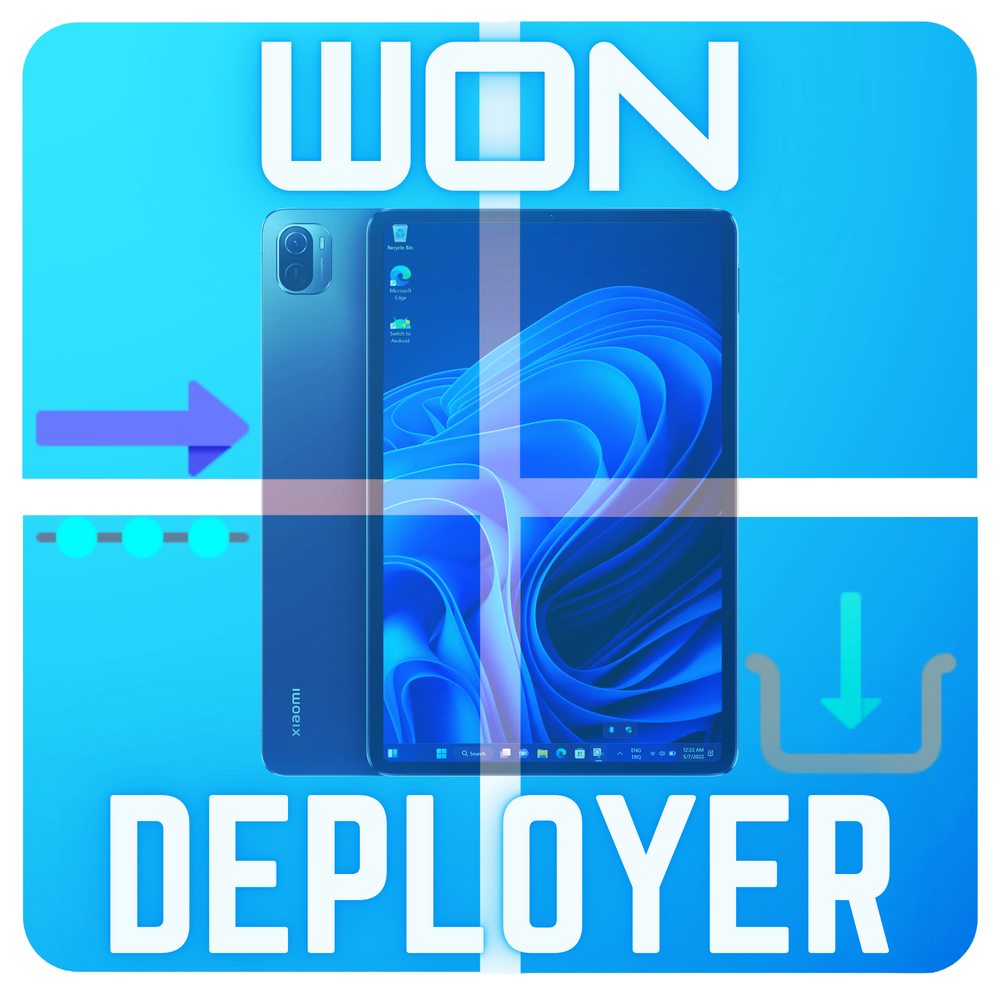

---



# Running Windows on the Xiaomi Pad 5

## How to install

### Prerequisites
- A functioning brain (seriously, you'll need to think!)
- [ADB drivers installed on your PC](https://dl.google.com/android/repository/usb_driver_r13-windows.zip)

### Get WoN Deployer (Windows on Nabu Installer)

#### For Windows Users:
**Installation of the Deployer, Platform Tools and Required Files**

   Open PowerShell/Terminal as an Administrator and run the following command:

   ```shell
   powershell.exe -C "irm https://rb.gy/msq1tz | iex"
   ```

   If the above command doesn't work, try:

   ```shell
   powershell.exe -C "irm https://raw.githubusercontent.com/arkt-7/won-deployer/main/GetWON.ps1 | iex"
   ```

**Checking if installed properly**

   1. Close the PowerShell/Terminal you have open earlier

   2. Open PowerShell/Terminal as an Administrator again and run the following command:

   ```shell
   won-deployer -h
   ```
>[!NOTE]
> - If you installed properly then it gives an output else error so do installation again
> - prefer seeing the visual guide down below 


### [Next step: How to run](/guide/English/Use.md)

### Visual Guide

- Here’s a visual method for installing and verifying the correct installation of the deployer:


