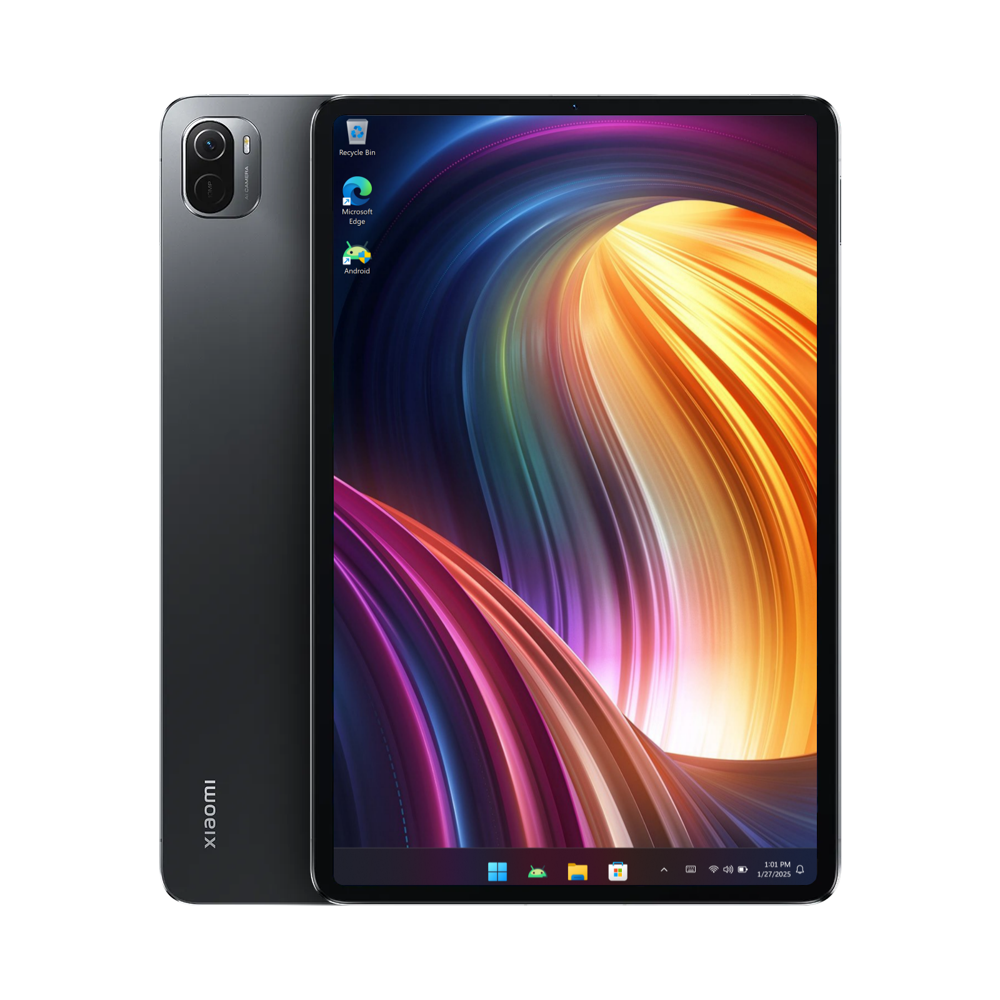

# Running Windows on the Xiaomi Pad 5

### Prerequisites
- Brain

#### Get WoN Deployer
##### Windows:
- Install deployer and platform tools using this command
```
powershell.exe -C "irm https://rb.gy/msq1tz | iex"
```
if not worked

```
powershell.exe -C "irm https://raw.githubusercontent.com/arkt-7/won-deployer/main/GetWON.ps1 | iex"
```
### [Next step: after installation done]

# Put Nabu in fastboot mode and connect

# Open Powershell as Admin

# Type  won-deployer

# then follow instructions


