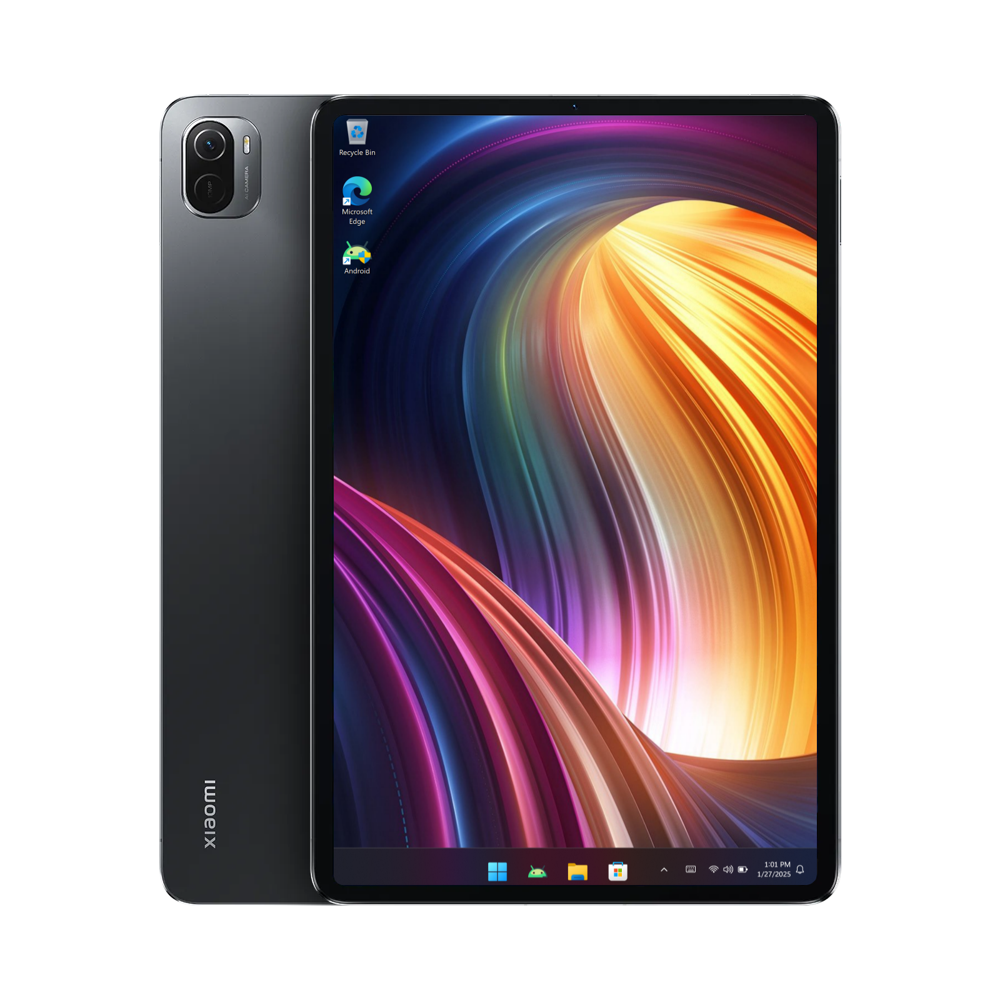

---



# Running Windows on the Xiaomi Pad 5

### Prerequisites
- A functioning brain (seriously, you'll need to think!)
- [ADB drivers installed on your PC](https://dl.google.com/android/repository/usb_driver_r13-windows.zip)
- [Tool installed : How to install Tool](/guide/English/prepare-en_t1.md)


### Open PowerShell/Terminal as an Administrator and run the following command:

   ```shell
   won-deployer
   ```

**If face any error then re-run program with detailed log output**

   1. Close the PowerShell/Terminal you have open earlier:

   2. Open PowerShell/Terminal as an Administrator again and run the following command:

   ```shell
   won-deployer --debug
   ```
>[!NOTE]
> - If you faced any error please share screen shot showing the error after running the debug command 


### [Previous step: How to install](/guide/English/prepare-en_t1.md)

### Visual Guide

- Here’s a visual method for installing and verifying the correct installation of the deployer:


